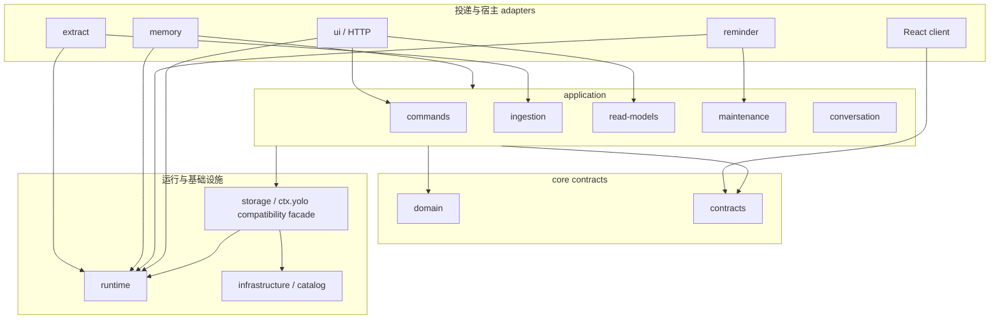

# 整体架构

YOLO 是运行在 deepseek-harness（dsh）中的本地个人助手插件。当前架构是**分层模块化单体**：保留五个 Cordis 宿主插件和既有 package 子路径，对内用 domain/application/contracts/runtime/infrastructure 分离事实、用例和适配器。

## 文档事实源边界

- 本目录描述当前已经实现的架构；[modules.md](modules.md) 是唯一模块索引。
- [`src/storage/schema.sql`](../../src/storage/schema.sql) 是 workspace SQLite schema 事实源。
- [`docs/testing.md`](../testing.md) 与 [`docs/testing-e2e.md`](../testing-e2e.md) 是验证契约。
- [`docs/VISION.md`](../VISION.md) 描述长期产品边界；未落地能力不能由愿景或研究报告反推为当前事实。
- [`docs/research/23-yolo-architecture-evolution-assessment.md`](../research/23-yolo-architecture-evolution-assessment.md) 保留迁移背景与评审结论，不替代本目录。

## 产品与数据不变量

- 管理而非代办；提醒和主动沟通只进入 YOLO 自有会话，不打扰普通工作会话。
- SQLite row 是 current state；events、evidence 和 receipt 是追加审计，不使用 event replay 重建当前状态。
- 同一事项跨会话依靠稳定 id、owner scope 和不可变 evidence，而不是标题启发式拼接。
- notification `seen_at`、reminder `handled_at` 与事项状态相互独立。
- dsh Agent task 观察和验收尚未实现；YOLO 也不编排外部 Agent。

## 当前分层



这是一次兼容迁移后的实际结构，不代表物理依赖已经达到最终纯六边形形态：application 目前仍通过 `Yolo` service 调用 workspace repositories，部分纯规则仍在 `shared/`。依赖测试防止旧的反向依赖重新出现，后续只允许继续收紧。

## 事实与用例 owner

| 事实或行为 | 当前 owner | 说明 |
|---|---|---|
| todo/goal/milestone 等领域类型 | `src/domain/types.ts` | `src/storage/types.ts` 仅兼容 re-export |
| scope identity 与 `ScopeRef` | `src/domain/scope.ts` | application 不以 cwd 作为稳定 identity |
| 动作写入语义 | `src/application/commands/` | HTTP、tool 和旧 `shared/actions` 复用同一 handler |
| 提取结果落库 | `src/application/ingestion/` | extract adapter 负责捕获/LLM，application 负责 accepted result 的写入组合 |
| dashboard/history/notifications/badge | `src/application/read-models/` | `src/ui/*` 只负责 HTTP 解析与响应 |
| Markdown snapshot cadence use case | `src/application/maintenance/` | reminder 只触发，不拥有投影规则 |
| YOLO 会话与 chat request | `src/application/conversation/` + `src/runtime/conversation-runtime.ts` | runtime 统一管理内部 resident 与面板 ephemeral Agent handles |
| 最近 cwd、最近用户文本、turn cadence、direct-human capture | `src/runtime/turn-observation.ts` | `ctx.yolo.observations` 是跨插件唯一实例 |
| workspace discovery 与 opaque `WorkspaceId` | `src/infrastructure/catalog/workspace-catalog.ts` | durable control DB；进程 Map 只是 ready cache |
| workspace current state、FTS、审计行 | `src/storage/` | workspace SQLite；`ctx.yolo` 暂时还是 repository/UoW 兼容 façade |
| 配置 shape 与默认值 | `src/contracts/config.ts` + `src/runtime/config.ts` | `src/ui/config.ts` 只保留 loader/import 兼容入口 |
| attention 纯排序 | `src/attention/` | application projector 提供输入并消费结果 |

## Scope 与数据拓扑

### WorkspaceId 与 ScopeRef

```ts
type ScopeRef =
  | { kind: 'workspace'; workspaceId: string }
  | { kind: 'user' }
```

`WorkspaceId` 在语义上是 catalog 分配并持久化的 opaque UUID，调用方不能从 cwd、`scope_key` 或 Git 状态推导它。当前 TypeScript 载荷仍以 `string` 表示，但其契约不是路径别名。

- cwd 在 dsh/HTTP/旧 API 边界规范化，并经 catalog 解析为 workspace `ScopeRef`。
- `scope_key` 继续是 workspace DB 文件和旧 payload 的兼容标识，由 infrastructure/storage codec 维护。
- 目录移动必须使用 catalog 的显式 `relocate(workspaceId, newCwd)`，并由 workspace DB marker 证明身份；移动不会改变 WorkspaceId 或既有 scope key。
- `{ kind: 'user' }` 目前只提供 user store 的显式解析基础；不会隐式扇出写入所有 workspace，也还没有 user-level tracking rule 产品能力。
- 不新增可写 `global` ScopeRef；跨工作区 dashboard/history 是多个明确 workspace 的只读聚合。

### 两层本地存储

```text
$DSH_HOME/yolo/control.db
  └─ workspaces(workspace_id, canonical_cwd, scope_key, last_seen_at, health)

<workspace>/.dsh/yolo/yolo-<scope_key>.db
  └─ plan current state + audit/evidence + notifications + indexes
```

catalog 只拥有发现和身份，不复制计划事实。catalog 注册是独立、幂等、可重放操作；它绝不与 workspace DB 组成跨库事务。

catalog 生命周期：

1. `Yolo` 启动时打开 control DB；损坏文件被隔离为 `.corrupt-*`，随后创建新 catalog。
2. 启动读取记录，仅把 marker 校验为 `ready` 的 workspace 放入运行 cache。
3. workspace store 首次解析时幂等注册，并把 `workspace_id/scope_key/identity` marker 写入 workspace meta。
4. 缺失 store 标记为 `stale`，路径或 marker 异常标记为 `invalid`；聚合读取跳过不可用 workspace 并暴露 partial/error。
5. `forget` 只删除发现记录，不删除 workspace SQLite 或 snapshot；`dispose` 关闭 workspace DB、observation 和 catalog。

## 写入路径

### 用户/客户端动作

```text
HTTP / model tool / compatibility facade
  → cwd compatibility input 解析为 ScopeRef
  → application/commands/apply-yolo-action
  → runInScopeRef
  → 单个 workspace UnitOfWork
  → current state + event/evidence + client idempotency receipt
```

`runWorkspaceTransaction` 只覆盖一个 workspace SQLite。带 `client_action_id` 的动作通过同库 idempotency record 执行；跨 workspace 批量动作逐 store 执行并返回部分结果，不伪装为原子事务。

### 对话提取

```text
agent/pre-step
  → ctx.yolo.observations 捕获本轮 direct-human messages
turn/end + whenIdle
  → extract adapter 执行 LLM / resolver
  → application/ingestion/apply-extraction
  → runIdempotentScopeAction（单 workspace store）
```

Goal continuation 和 YOLO 自有 session 不进入 direct-human capture。兼容旧宿主时允许更弱 fallback，但仍要求 `source.kind === 'user'`，且不能声称拥有 durable turn 级 exactly-once。

## 读取路径

`application/read-models` 从每个 ready workspace store 构建 dashboard、history、notifications 和 badge，再进行确定性聚合。HTTP controllers 只解析请求、解析 scope、调用 projector 并序列化版本化 contracts。单个 workspace 失败时保留其他结果并设置 partial/error，不使用另一个 workspace 兜底。

记忆召回仍由 memory adapter 协调 FTS、可选语义扩写/重排与 prompt 注入；最近用户文本和 cwd 统一从 observation service 获取。召回失败保持确定性 FTS 降级，不改变计划 current state。

## 运行时观察与会话

`Yolo` storage provider 在 Cordis 上只注册一组 session/turn listeners，并更新唯一的 `TurnObservationService`。extract、memory、reminder 和 UI 只读取或消费 observation，不再各自维护 `latestCwd`、`lastUserText` 或 turn count。

`ConversationRuntime` 是 YOLO 创建的 Agent handle owner：`yolo-w-*` resident 只供提醒/简报等内部投递，不作为顶层聊天历史；用户每次显式打开“和助手聊聊”都会生成新的 `yolo-a-*` ephemeral thread；事项讨论按事项 episode 复用其 `yolo-a-*` thread，显式结束后下次再创建。UI 与 reminder 共享同一 runtime，`src/ui/session.ts` 与 `src/ui/chat-requests.ts` 只作兼容 re-export。

## 五个宿主插件与兼容入口

对外仍保持：

| 插件 | package subpath | 适配器职责 |
|---|---|---|
| `yolo-storage` | `dist/src/storage` | `ctx.yolo` provider、catalog、workspace DB、runtime observation |
| `yolo-memory` | `dist/src/memory` | 模型工具、召回、prompt 注入 |
| `yolo-extract` | `dist/src/extract` | turn 捕获、LLM 提取、ingestion 调用 |
| `yolo-reminder` | `dist/src/reminder` | scheduler、brief、通知投递、snapshot trigger |
| `yolo-ui` | `dist/src/ui` | settings 与 `/yolo/*` HTTP adapters |

稳定兼容 façade 包括 `ctx.yolo`、`src/shared/actions.ts`、`src/storage/types.ts`、`src/ui/config.ts`、`src/ui/session.ts`、`src/ui/chat-requests.ts`、`src/ui/workspace-scope.ts` 以及各 UI read-model re-export。新代码应 import 明确 owner，不能把 façade 当成新增职责落点。

## 架构门禁

- `tests/architecture-dependencies.test.ts` 当前要求：`shared` 不依赖 UI；extract/memory/reminder 不依赖 `ui/session`；client 不依赖 storage types、shared actions 或 UI config。legacy allowlist 已为空。
- `tests/package-loader-contract.test.ts` 固定 package root/client/五个 host exports、Cordis patch rows、storage default export、plugin `name/inject/apply`、`yolo` 配置 namespace/default、host/client build entries 和运行资产。
- `tests/workspace-catalog.test.ts` 覆盖重启恢复、幂等注册、损坏隔离、stale/invalid、relocate/forget。
- `tests/turn-observation.test.ts` 覆盖并发 session 隔离、late steering、事件幂等、YOLO session 排除和有界清理。
- `pnpm check`、`pnpm test:run`、`pnpm build` 与适用的真实宿主/API/Edge 场景共同构成交付门禁；源码测试不能替代真实宿主证据。

## 当前未完成边界

- dsh Agent task 的 read-only observation、详情和 acceptance 尚未实现。
- user-level tracking rule、recall application receipt 和 memory utility 尚未实现。
- application 仍通过 `Yolo` concrete service 访问 repositories，`storage/repository.ts` 尚未按 aggregate 物理拆分；这是兼容迁移状态，不是新增代码应继续扩大的模式。
- 旧 façade 仍有消费者时保留；只有消费者迁移并通过 package/host 门禁后才能删除。
