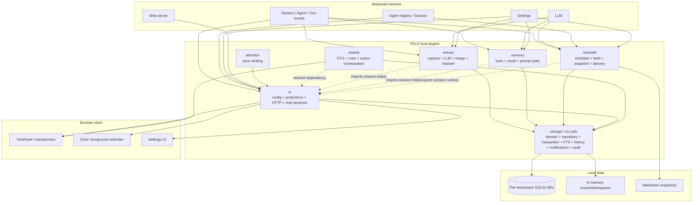
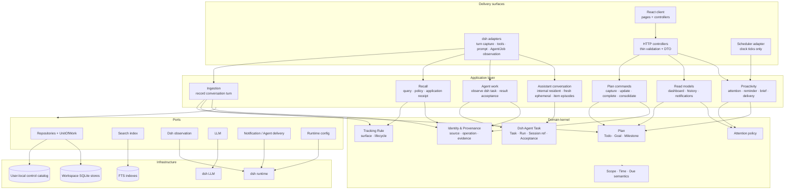

# YOLO 全局架构与演进路线评估

> 日期：2026-08-30
> 范围：当前 dsh-yolo 全部宿主模块、存储、记忆、提醒、判断、HTTP、对话与浏览器客户端
> 性质：Phase 0–5 的评估、实施规格与迁移结果记录；当前事实仍以 `docs/architecture/` 为准
> 核心问题：继续局部修补，还是在新增 Agent 任务与记忆治理前进行结构性重构？

本规格吸收独立评审提出的六项硬条件：完整事实 owner、严格 `ScopeRef`、durable catalog 生命周期、single-store UnitOfWork、宿主/打包兼容门禁，以及“一次交付但逐阶段提交”。这些条件已经进入 Phase 0–5 实现与自动门禁；最终交付仍需以本次集成的全量测试、真实宿主证据、`develop` 合入和远端核对为准。

## 实施结果（2026-08-30）

Phase 0–5 已在架构迁移分支按可回退提交落地；本节记录代码结构，不把后续 Agent task 或下一代记忆能力算作本次实现。

| 阶段 | 提交 | 已实现结果 |
|---|---|---|
| Phase 0 | `60fa918` | dependency fitness、package/Cordis loader contract 与本实施规格；legacy dependency allowlist 可收紧 |
| Phase 1 | `8a4de08` | 配置 shape/default owner 迁到 `contracts/runtime`，旧 UI config path 兼容 |
| Phase 2 | `559a53a` | `ScopeRef` 骨架、application command/dashboard owner、single-workspace action transaction 与旧 actions/dashboard façade |
| Phase 3 | `96f6f3a` | badge/history/notifications projector 迁到 application read-models，UI 缩为 HTTP adapters |
| Phase 4 | `5063fd5` | domain types、ingestion/maintenance/conversation owner、durable workspace catalog、single `TurnObservationService`、conversation runtime 与 scope 接线 |
| Phase 5 | `f4fef26` | Dashboard/detail/notification/Kanban action controllers；client DTO 统一走 contracts，shell/board 控制职责缩小 |

实现保持五插件/package/HTTP/SQLite/客户端 IA 兼容，没有引入 event sourcing 或跨库事务。`ctx.yolo`、`shared/actions`、`storage/types`、`ui/config/session/chat-requests/workspace-scope` 和 UI projector paths 仍按明确 deprecation/compatibility 语义存在。application 目前仍通过 concrete `Yolo` service 访问 repository，`storage/repository.ts` 也尚未按 aggregate 物理拆分；这是后续只能继续收紧的迁移债务，不应被描述为已经完成最终 ports 纯化。

会话语义也已固定：`yolo-w-*` resident 只供提醒等内部投递；顶层“和助手聊聊”每次显式打开生成新的 `yolo-a-*` ephemeral thread，不展示 resident 历史；事项讨论按事项 episode 复用其 ephemeral thread。

durable catalog 当前只持久化 workspace discovery 与 opaque WorkspaceId。user-level tracking rule、dsh Agent task projection/acceptance、recall application receipt 和 memory utility 均尚未实现。

## 一、结论

YOLO 当前不是“设计错误”，而是已经越过了适合继续 feature-by-feature 扩张的复杂度阈值。

早期的五插件拆分解决了部署和能力装配问题，统一动作、不可变证据、确定性判断和真实宿主测试也建立了很强的产品正确性。但随着跨工作区聚合、history、notification、resident/anchored chat、语义召回、身份裁决和未来 dsh Agent 任务逐步加入，**代码模块的实际边界已经不再对应插件边界**：

- `shared` 不再是共享基础层，而是包含应用编排并反向依赖 UI；
- `storage` 不再只是存储，而是同时拥有领域动作、事务、索引、历史、通知、召回审计和迁移；
- `ui` 不再只是 HTTP，而是拥有配置、投影、工作区路由、Agent Session 和请求状态；
- `reminder`、`extract`、`memory` 直接依赖 `ui/session`；
- 工作区、最近 cwd、会话和运行期缓存由多个插件分别维护；
- 浏览器 shell 与页面内容形成数个千行级控制组件。

如果现在继续把 surface-scoped memory、recall receipt、tracking rule lifecycle 和 dsh Agent 任务直接加到现有目录，短期能工作，但会形成更多反向依赖和第二份状态。

因此建议：

> **进行一次大规模内部架构重构，但采用兼容、分阶段的迁移方式，不做大爆炸式重写。**

更准确地说是：**大改架构，小步迁移；冻结新的跨模块能力，继续处理必要的正确性缺陷。**

## 二、当前架构全景



这张图揭示的问题不是“箭头多”，而是 **依赖方向和事实所有权混在一起**：

- application action 位于 `shared`，却调用 `ui/dashboard` 读取当前判断；
- dsh Session runtime 位于 `ui/session`，却被 extract、memory、reminder 复用；
- 设置 schema 位于 UI，但其他插件通过结构化猜测读取；
- snapshot 是 storage projection，却由 reminder 统计 turn 和调度；
- workspace registry 是全局看板和提醒的基础，却只存在于 storage service 的进程内 Map。

## 三、当前架构中应保留的部分

大改不意味着推翻全部。以下资产已经被真实场景验证，应作为迁移护栏保留。

### 3.1 产品与领域不变量

- 管理而非代办；普通工作会话保持安静；
- commitment / goal / milestone / tracking rule 的管理型记忆范围；
- Agent 任务只观察和承接 dsh 任务，不在 YOLO 内编排；
- Agent task 成功不自动完成 YOLO todo；
- SQLite 是运行事实源，Markdown 只是审阅投影；
- 当前状态与用户可见历史分离；
- 同一事项跨会话使用稳定 canonical identity 和不可变 evidence；
- attention 只基于可审计事实，并绑定 reason version + evidence fingerprint。

### 3.2 已验证的正确性机制

- `agent/pre-step` direct-human 边界与 Goal 自动 continuation 排除；
- extraction operation、tool call、client action 与 evidence fingerprint 幂等；
- 所有领域状态变化走统一动作并写事件；
- due date/date-time 的统一语义；
- notification `seen_at`、reminder `handled_at` 和事项状态相互独立；
- partial workspace failure 显式暴露；
- resident/anchored conversation 隔离；
- 语义召回失败时确定性 FTS 保底；
- 真实 dsh 宿主、HTTP 和 Edge E2E 验收。

### 3.3 应保持兼容的外部契约

- 现有 SQLite 数据与迁移能力；
- `ctx.yolo` 服务名；
- `/yolo/*` HTTP 路径及版本化载荷；
- npm 子路径和 Cordis patch 入口；
- 首页 / 计划 / 历史与 340px 上下文体验；
- 模型工具与现有行为语义；
- W1–W16 与现有 E2E 场景。

## 四、为何已经需要结构性重构

### 4.1 实际依赖方向已经失守

当前存在明确的反向或跨适配器依赖：

```text
shared/actions  -> ui/dashboard
extract         -> ui/session
memory          -> ui/session
reminder        -> ui/session
storage         -> shared domain rules
client          -> shared + ui/config + storage types
```

`shared` 文档也已承认它不是无依赖基础层。继续向其中添加 Agent task action、memory candidate 或新的 DTO，只会扩大所有模块的共同重编译和理解范围。

### 4.2 `ctx.yolo` 已成为 God Service

当前 `src/storage/` 约 3,700 行；`repository.ts` 约 1,700 行，`index.ts` 约 670 行。它同时负责：

- scope 与 DB 生命周期；
- todo/goal/milestone/preference/event CRUD；
- 领域状态迁移；
- evidence、identity、consolidation；
- notification、attention feedback、client idempotency；
- extraction/recall/resolver audit；
- FTS、history、snapshot、migration。

问题不是文件长度本身，而是 adapter 可以调用大量低层方法，绕过应用用例。`memory_write`、extract、HTTP 和 reminder 目前依靠约定选择正确方法，缺少结构上的合法路径约束。

### 4.3 同一运行事实被多处各自跟踪

当前至少有以下重复状态：

- memory：`lastUserText`、`lastSessionCwd`、recall tracker；
- reminder：`latestCwd`、turn count、独立 `YoloSessions`；
- ui：latest cwd、resident/anchored sessions、chat request registry；
- storage：进程内 `knownWorkspaces`；
- client：独立页面、foreground、conversation、request 和 notification state。

这导致 source-kind 语义、Session 切换和宿主重启行为需要在多个模块重复修补。

### 4.4 作用域模型与长期产品方向未真正接线

`scope.ts` 支持 workspace/user/global，设置也暴露 `storage.scope`，但业务调用全部默认走 workspace。与此同时：

- dashboard、brief、history 和 badge 已经跨工作区聚合；
- 已知工作区注册表只在进程内；
- tracking rule 有些应属于 workspace，有些应属于 user；
- dsh Agent task 天然跨 parent/child Session，并不等同于某个 todo；
- 长期产品是管理工作与生活，不只是当前 cwd 的 todo。

继续使用“每个入口传 cwd，存储层隐式决定 scope”的方式，会让未来每项能力都重新解决一次全局/工作区归属。

### 4.5 读取投影被误归到 UI

`src/ui/dashboard.ts`、history、notifications 和 badge 实际上是 application read model，不是 HTTP 细节。因为它们位于 UI：

- action 编排为了校验 attention 反向调用 UI dashboard；
- reminder/brief 重复实现部分聚合判断；
- 未来 CLI、模型工具或 Agent task 也会想复用投影，进一步依赖 UI。

### 4.6 客户端已经形成新的控制单体

`client/panel` 约 5,600 行，`KanbanView.tsx` 约 1,100 行，`YoloPanel.tsx` 约 980 行。它们同时承载页面编排、API、动作、上下文、通知、来源、对话和响应式状态。

客户端仍遵守服务端事实，但新增 Agent task 页面、memory candidate review 或更多详情时，会继续扩大这两个控制组件。应先建立 page/use-case controller 边界。

## 五、小修还是大改

### 5.1 可以继续小修的范围

以下属于独立正确性问题，可以在重构前后正常修复：

- 已暴露但未接线的配置；
- cache TTL/LRU 和日志 retention；
- terminal FTS 清理；
- 明确的数据泄漏、并发串扰或幂等缺陷；
- 不改变模块所有权的 E2E 回归；
- 当前另一个会话正在完成的聊天请求生命周期修复。

### 5.2 不应继续在当前结构中追加的能力

- tracking rule surface/lifecycle/candidate；
- recall application receipt 与 utility；
- dsh Agent task 数据模型、列表、详情和验收；
- 新的全局用户级 scope；
- 新的跨工作区自动判断；
- 任何新增 mutation 入口；
- 新的 resident/child Agent lifecycle。

这些都会横跨 storage、shared、ui、memory/extract、reminder 和 client。继续局部实现会固化错误边界。

### 5.3 判定

| 选项 | 短期成本 | 中期结果 | 判定 |
|---|---:|---|---|
| 继续小修小补 | 低 | 功能可交付，但每项新能力扩大耦合，Agent task 会成为新的跨层特例 | 不建议 |
| 一次性重写 | 极高 | 数据、宿主兼容和真实场景容易回归，长时间无可交付结果 | 不建议 |
| 目标架构大改 + 兼容迁移 | 中高 | 保留已验证行为，逐用例替换内部路径，未来能力进入稳定位置 | **建议** |

## 六、目标架构原则

### 6.1 采用分层模块化单体

YOLO 不需要微服务或通用框架。目标是一个本地、分层的 modular monolith：

1. **领域层**：定义事实、状态机、身份和纯规则；不依赖 Cordis、SQLite、HTTP、React。
2. **应用层**：定义用户用例和事务边界；只依赖领域和 ports。
3. **基础设施层**：SQLite、FTS、迁移、scheduler、LLM、dsh Session 等实现 ports。
4. **投递适配器**：dsh events/tools/prompt、HTTP 和浏览器 UI。
5. **跨边界 contracts**：版本化 DTO、command、query、receipt 和 error。

### 6.2 一条事实只有一个 owner

| 事实 | Owner |
|---|---|
| todo/goal/milestone/tracking rule 当前状态 | Plan domain + workspace repository |
| 事项来源、变化与审计 | Provenance/Event repository |
| 工作区目录与 user-level scope | Local control catalog |
| dsh Session/Turn/Job/Subagent 状态 | dsh adapter；YOLO 只保存管理投影 |
| attention 判断 | Attention policy + read model projector |
| notification/read/handled/delivery | Proactivity application service |
| recall candidates/application | Recall application service |
| HTTP、模型工具和点击 | Delivery adapters，不拥有领域状态 |
| 客户端 optimistic/request state | Client controller，不冒充服务端结果 |

为了避免“模块名清楚、具体数据仍无人负责”，实施时以以下完整清单作为 owner 契约。表中 owner 是唯一允许定义写入语义和生命周期的模块；其他模块只能通过 application port 使用它。

| 当前持久化表 / 运行态事实 | 唯一 owner | 目标落点与约束 |
|---|---|---|
| `meta`、workspace schema version | WorkspaceStore infrastructure | 仅迁移器写；application 不感知具体版本键 |
| `user_profile` | Profile domain / repository | 仍在 workspace store；若未来提升为 user 级，必须走显式迁移，不能双写 |
| `todos`、`goals`、`milestones` | Plan domain / repositories | 只有 Plan command handler 能改变状态 |
| `todo_evidence` | Provenance repository | 与对应 Plan mutation 在同一 workspace UoW 提交 |
| `preferences`、`preference_history` | TrackingRule/Profile domain | workspace 规则留在 workspace store；user 规则只能进入 catalog store |
| `events` | Audit/Event repository | 追加写；不得作为 current-state replay 源 |
| `session_summaries` | Conversation ingestion application | dsh adapter 提供观测，repository 只持久化已确认摘要 |
| `notifications`、`pending_reminders` | Proactivity application | `seen_at`、`handled_at` 和事项状态继续分离 |
| `attention_feedback` | Attention application | policy 纯函数不直接持久化 |
| `client_actions` | Command idempotency repository | 由 command bus/UoW 管理，HTTP 与 client 不直接访问 |
| `extraction_log`、`todo_resolution_log` | Ingestion/Identity application | advisory 结果不得绕过 Plan command handler 写 current state |
| `recall_log` | Recall application | recall candidate、注入和应用 receipt 的审计 owner |
| `yolo_fts`、`todo_identity_fts` | Search infrastructure | 可重建索引，不是独立事实源 |
| Markdown snapshot | Maintenance application | 只读投影，可删除重建；reminder 不再拥有 turn cadence |
| durable workspace registry | UserLocalCatalog | catalog 唯一写入；进程内 Map 只允许作为 cache |
| user-level tracking rule | UserLocalCatalog + TrackingRule repository | 不复制到各 workspace DB |
| dsh Agent task projection / acceptance | AgentWork application + catalog repository | dsh Job/Session 是外部事实，YOLO 只保存观察和管理投影 |
| `latest cwd`、session source、turn sequence | TurnObservationService | 每个 session 一份记录；extract/memory/reminder/ui 只订阅快照 |
| 内部 resident / 顶层 ephemeral / item episode identity | ConversationService | dsh adapter 管生命周期；业务模块只持有 typed reference |
| scheduler tick / clock | Scheduler adapter | 只发出时间信号，不拥有 reminder 或 snapshot 状态 |
| dashboard/history/notification/badge projection | Application read-model services | 无写入权，不落为第二份 current state |
| client route/request/optimistic state | 对应 page controller | 页面卸载时清理；不得推导或覆盖服务端领域事实 |

### 6.3 不引入完整 event sourcing

当前 SQLite row 继续是 current state，events/evidence 继续是追加审计。目标不是把所有状态改成 event replay，而是确保：

- 一次应用 command 在同一事务内写 current state + evidence/event + idempotency receipt；
- adapter 无法直接调用 repository 的裸状态修改；
- read model 只从 repository 读取，不成为第二个写入事实源。

### 6.4 Scope 成为显式领域类型

所有 application use case 接收：

```ts
type ScopeRef =
  | { kind: 'workspace'; workspaceId: WorkspaceId }
  | { kind: 'user' }
```

cwd 只在 dsh/HTTP adapter 边界出现，经 durable catalog 解析成 `ScopeRef`。这样 user-level tracking rule、workspace plan 和 dsh Agent task 不再靠每个调用方隐式猜 scope。

`ScopeRef` 的实施语义必须固定为：

- `WorkspaceId` 是 catalog 分配并持久化的稳定 opaque id，不是 cwd 的字符串别名；路径大小写、盘符形式和目录移动不改变已有领域 identity；
- `{ kind: 'workspace' }` 只允许读写该 workspace store 的事实；workspace command 必须在进入 application 层前已经解析完成，领域层禁止接收 cwd；
- `{ kind: 'user' }` 只允许访问 catalog store 中的用户级事实，例如 user tracking rule、workspace registry 和 Agent task 管理投影；不能隐式扇出修改所有 workspace；
- 当前 schema 中已有的 `scope_key` 在兼容期仍可存在，但只由 infrastructure codec 解释；adapter 和 application 不得拼接或解析它；
- 暂不引入第三种 `global` scope。跨工作区 dashboard/history 是对多个明确 workspace scope 的只读聚合，不是一个可写 global aggregate；
- HTTP 的 `scope_cwd`、dsh Session 的 cwd 和旧 `ctx.yolo` cwd 参数都是 compatibility input。解析失败、路径歧义或 catalog 中不可用时必须返回 typed error/partial failure，不能回退到另一个 workspace；
- user 与 workspace 之间的数据提升或下放是显式迁移命令，禁止调用方为了方便双写两层 store。

## 七、目标全景架构



这张图的关键不是目录名称，而是依赖只能向内：surface → application → domain。基础设施实现 port，但 domain/application 不反向 import SQLite、UI 或 dsh runtime。

## 八、目标数据架构

### 8.1 保留 workspace store，新增 user-local control catalog

项目愿景同时要求“工作区本地计划”和“跨工作区个人助手”。建议采用两层本地存储，而不是把全部数据迁入一个全局 DB：

#### Workspace SQLite

继续拥有：

- todo / goal / milestone；
- workspace tracking rule；
- todo evidence；
- workspace events；
- workspace FTS 与快照。

#### User-local control catalog

新增或正式接线：

- durable workspace registry；
- user-level tracking rules；
- dsh Agent task projection与 acceptance；
- schema/capability version；
- global application/idempotency identity；
- 必要的跨工作区 read-model watermark，而不是复制完整计划事实。

这样既保留项目自包含性，又让宿主重启后仍知道有哪些工作区，并为工作/生活和 Agent task 提供明确 user scope。

#### Catalog 生命周期

catalog 是本机当前用户的控制面数据库，不跟随任一 workspace，也不通过 npm 包目录定位。它的生命周期如下：

1. **bootstrap**：storage compatibility facade 首次启动时，从宿主提供的用户数据目录解析固定路径并打开 catalog；路径解析是 infrastructure 责任，测试可注入临时目录；
2. **register**：第一次看到可用 cwd 时，规范化真实路径、分配稳定 `WorkspaceId`，以唯一约束幂等登记；旧进程内 `knownWorkspaces` 由 catalog 查询结果填充为 cache；
3. **touch/open**：每次成功打开 workspace store 更新 `last_seen_at`、能力/schema 版本和当前规范路径，但不能改变 `WorkspaceId`；
4. **relocate**：只有显式确认或可证明的 store identity 匹配时才更新路径。相同路径指向不同 store、一个 store 对应多个候选路径时返回冲突，禁止启发式合并；
5. **unavailable**：路径暂时不可访问时记录 `last_error`/`unavailable_since`，聚合查询返回 partial；不因一次启动或磁盘离线删除 registry 行；
6. **forget**：只有显式维护动作才能 tombstone/删除 registry 行；forget 不删除 workspace 自身 SQLite，恢复登记仍优先复用可证明的 identity；
7. **shutdown/recovery**：catalog 和 workspace store 分别正常关闭；崩溃恢复依赖 SQLite 原子事务，不依赖内存 Map 或 Markdown snapshot。

catalog schema、迁移和 repository 归 `UserLocalCatalog` infrastructure；workspace 发现、Agent task acceptance、user rule 等 application service 只能使用 typed ports。catalog 的 read-model watermark 必须可删除重建。

### 8.2 聚合查询仍允许 partial

跨工作区 dashboard/history 可继续逐 store 读取，并保留 partial 语义。catalog 只负责发现与路由，不成为 workspace plan 的副本。

如果未来性能证明逐库读取不足，再增加可重建 read-model cache；不能提前双写一个新的计划事实源。

### 8.3 UnitOfWork：一次命令只提交一个 store

YOLO 不引入跨 SQLite 的分布式事务。`UnitOfWork` 的硬约束是 **single-store**：

- workspace command 在一个 workspace transaction 内提交 current row、event/evidence 和 idempotency receipt；
- user command 在一个 catalog transaction 内提交 user-level state、event/receipt；
- 同一 command handler 不得同时持有 catalog transaction 和 workspace transaction；
- `bulk_*`、跨工作区聚合动作由 application orchestrator 拆成多个具有独立 operation id 的单-store command，逐项返回 `succeeded/failed`，保持现有 partial 语义；
- 如果一个 workspace mutation 之后需要更新 catalog watermark，watermark 是可重建的异步/事后写入，失败不能回滚已提交的领域事实，也不能伪装成原子成功；
- repository 的裸 SQL/状态 setter 只在 infrastructure 内可见，adapter、projector 和 scheduler 不得绕过 UoW；
- compatibility facade 可以保留旧方法签名，但必须立即翻译为 typed command/query，并在 Phase 2 后不再直接组合 repository 调用。

这一约束优先于“把所有动作包装在一个大事务里”的表面一致性；它让失败边界与实际 SQLite 能力一致，也避免 catalog 成为新的 God Store。

## 九、目标模块映射

| 当前模块 | 目标归属 | 处理方式 |
|---|---|---|
| `shared/actions.ts` | `application/commands` | 拆为 typed command handler；移除对 `ui/dashboard` 的依赖 |
| `shared/dashboard*.ts` | `contracts/read-models` + application projector | DTO 与投影规则分离 |
| `shared/due.ts`、identity、quality | `domain` | 保持纯函数并禁止 adapter 依赖 |
| `storage/repository.ts` | `infrastructure/sqlite/repositories/*` | 按 aggregate/repository 拆分；不拥有应用编排 |
| `storage/index.ts` | compatibility facade + UnitOfWork/Repository ports | 逐步缩小 `ctx.yolo` 裸方法面 |
| `extract` | dsh turn adapter + `application/ingestion` | capture 与 use case 分开；resolver 是 advisory service |
| `memory` | dsh prompt/tool adapter + `application/recall` | 最近 turn 状态统一由 observation service 提供 |
| `attention` | `domain/attention` | 保留纯策略；投影读取移到 application |
| `reminder` | scheduler adapter + `application/proactivity` | snapshot maintenance、brief、delivery 分开 |
| `ui/dashboard/history/...` | `application/read-models` + thin HTTP controllers | 允许 CLI/工具复用，不再属于 UI |
| `ui/session.ts` | `adapters/dsh/conversation` | extract/memory/reminder 不再 import UI |
| `ui/config.ts` | `runtime/config` + shared contract | 配置 owner 从 UI 移出 |
| `client/YoloPanel` | panel shell + page controllers | shell 只管路由/foreground；页面拥有各自行为 |
| `client/KanbanView` | Home/Plan/History pages | 按用户页面拆分，不按历史版本目录拆分 |
| `client/panel/v2` | stable page/domain names | 迁移完成后删除版本型目录名 |

## 十、迁移路线

### Phase 0：冻结与特征化

目标：在移动代码前固定现有行为。

- 冻结 Agent task、tracking candidate、utility 等跨模块新能力；
- 继续处理数据丢失、安全、幂等和当前聊天生命周期缺陷；
- 为关键 use case 保存 contract fixtures：capture、complete、postpone、attention feedback、reminder、dashboard、history、chat；
- 增加依赖方向检查：规则立即生效，当前例外必须逐文件写入带原因的 legacy allowlist；allowlist 只能收紧，新增例外即测试失败；
- 固定 schema、HTTP、tool 和 client payload 版本；
- 固定宿主装载契约：五个插件 subpath export 与 patch row、storage default export、每个插件的 `name/inject/apply`、`yolo` settings namespace/默认配置、host/client build entry 与 schema/client wrapper 资产；
- Phase 0 本身必须全绿，不能把“未来会迁移”当成测试失败理由。

### Phase 1：建立 domain/application/contracts 骨架

目标：不改 schema、不改用户行为，先建立正确依赖方向。

- 创建 `domain/`、`application/`、`contracts/`、`adapters/`、`infrastructure/`；
- 迁移 due、scope identity、quality、attention 等纯规则；
- 抽出 dsh session identity 与 YOLO thread identity，删除对 `ui/session` 的横向依赖；
- 将配置 schema 移到 runtime/config；
- 旧路径保留 re-export/compatibility facade。

### Phase 2：统一写入用例与事务

目标：所有 mutation 只有应用层入口。

- 将 `applyYoloAction` 拆成 plan、attention、notification、maintenance command handlers；
- 引入 single-store UnitOfWork，确保 state + event/evidence + idempotency 在同一个 workspace 或 catalog 事务；
- memory tool、extract、HTTP 只调用 command use case；
- repository 不再暴露给 adapter 直接 set 状态；
- 移除 `shared/actions -> ui/dashboard` 反向依赖。

### Phase 3：统一读取投影

目标：dashboard/history/notification/recall 成为 application read model。

- 将 `ui/dashboard.ts` 等移出 UI；
- attention 校验读取 projector，而不是 HTTP 模块；
- 定义版本化 query/DTO；
- brief、badge、模型工具复用同一 read service；
- 逐步清空 generic `shared/`。

### Phase 4：统一运行时观察与 scope

目标：解决多插件重复状态和宿主重启。

- 建立 per-session TurnObservationService；
- memory/extract/ui/reminder 从同一 source-kind-aware observation 读取；
- 持久化 workspace catalog；
- 正式接线 `ScopeRef workspace|user`；
- 将 snapshot 迁到 maintenance job，将 resident delivery 迁到 dsh conversation adapter；
- 评估 user-level tracking rule 数据迁移。

### Phase 5：客户端控制器拆分

目标：在服务端边界稳定后再拆 UI。

- `YoloPanel` 只保留 shell、route、foreground 和 layout；
- Home、Plan、History、Notifications、Conversation 使用独立 controller/hooks；
- 消除同一动作在 shell/Kanban/v2 多处编排；
- 保持现有视觉、IA 和真实浏览器行为不变。

### 一次交付、分阶段提交

Phase 0–5 可在同一次授权交付中连续完成，但不是一个不可审查的巨型提交。实施分支必须按下列顺序形成可独立验证、可回退的提交：

1. Phase 0：规格、characterization、dependency/loader fitness；
2. Phase 1：domain/application/contracts 骨架与 compatibility re-export；
3. Phase 2：single-store UoW 与 mutation command；
4. Phase 3：read-model/query 迁移；
5. Phase 4：TurnObservationService、catalog 与 ScopeRef 接线；
6. Phase 5：client controllers 与旧路径清理；
7. integration：文档事实源同步和最终门禁（若前一提交已经同步则只做证据，不制造空提交）。

每个提交完成对应定向测试后再进入下一阶段；任何阶段发现 compatibility 回归，应修复或回退该阶段，不能用后续阶段掩盖。最终一次合入 `develop` 并只推送 `origin/develop`，不推送功能分支，也不自动更新 `main`、tag 或 npm 版本。

### Phase 6：新增能力

在 Phase 1–4 完成后再接入：

- tracking rule lifecycle/candidate；
- recall application receipt；
- dsh Agent task observation与 acceptance；
- autonomous situation recall；
- 有真实证据后再评估 memory utility。

## 十一、每个阶段的准入门

每个阶段必须同时满足：

1. 没有新增反向依赖；
2. 旧 import 和外部契约有 compatibility path；
3. schema/data migration 可重放、可中断、可恢复；
4. `pnpm check`、`pnpm test:run`、`pnpm build` 通过；
5. 受影响 API/宿主/UI 走对应 E2E 和 W1–W16；
6. 真实 dsh profile 加载的是当前 linked bundle；
7. 性能、partial、幂等和失败降级不退化；
8. 阶段结束即删除已无消费者的旧路径，不能无限双轨。

此外，Phase 0–5 的最终宿主兼容门禁必须逐项有证据：

| 契约 | 自动门禁 | 最终运行门禁 |
|---|---|---|
| package root + 五个 host subpath exports | package contract test + `pnpm build` 后目标存在 | 标准 `dsh plugin --profile web add .` 可解析 |
| bare client row + 五个 host patch rows | Cordis patch contract test | 标准 profile 无 `invalid plugin` / duplicate row |
| storage default export；所有 plugin `name/inject/apply` | loader module contract test | 五个插件全部出现加载证据 |
| `settingsNamespace('yolo')` 与 default config | config/loader contract test | 无 config stanza 启动成功，设置页读取默认值 |
| host ESM、client wrapper、`schema.sql` | build asset contract test | `/yolo/dashboard` 可访问且侧栏客户端成功注册 |
| HTTP/tool/client payload 与数据库兼容 | characterization + unit/API E2E | 隔离 `DSH_HOME` 的真实对话与 W1–W16 受影响场景 |

不能用源码级测试替代最后一列；也不能用共享 3080 宿主作为当前构建证据。

## 十二、长期架构治理

架构不应只靠一次重构维持。建议增加以下“演进控制器”：

### 12.1 Dependency fitness test

自动验证：

- domain 不 import application/adapters/infrastructure/client；
- application 不 import concrete SQLite、HTTP、React；
- adapter 之间不得横向 import；
- client 只能 import contracts 和明确共享的纯展示规则；
- generic `shared` 不再新增文件。

### 12.2 Feature architecture checklist

每个跨模块功能在实现前回答：

1. 这项事实的唯一 owner 是谁？
2. 写入 use case 和事务边界是什么？
3. 追加证据或 receipt 是什么？
4. read model 是什么，是否可重建？
5. scope 是 workspace 还是 user？
6. dsh/HTTP/client 只是哪个 adapter？
7. 失败时 fail open、partial 还是 fail closed？
8. migration、rollback 和 E2E 证据是什么？

### 12.3 Stable architecture documents

迁移后的当前事实已回写 `docs/architecture/`：

- `overview.md` 描述当前全景、事实 owner、ScopeRef/catalog/UoW/runtime 与 compatibility 边界；
- 每个顶层模块只维护一个正文；
- `modules.md` 是唯一索引；
- 本报告保留决策与阶段映射，不替代稳定架构事实源；
- VISION、current architecture、tests、CHANGELOG 继续保持各自边界。

## 十三、立即决策建议

### 本次迁移后的下一步

- 另一个会话正在进行的独立 bug/UI 生命周期修复；
- 数据丢失、安全、幂等、类型和真实宿主回归；
- 继续收紧 application 到 repository ports 的依赖和 compatibility façade 消费者；
- 对 catalog/ScopeRef/observation/controller 变更执行隔离真实宿主、API、Edge 与适用 W1–W16 验证；
- 新能力进入前继续执行事实 owner、scope、事务、read model 与失败模式检查。

### 现在暂停

- 直接实现报告 21 的 dsh Agent task；
- 直接实现报告 22 的 tracking candidate、recall receipt、utility；
- 新增跨工作区或 user-global 行为；
- 绕过已建立 owner，重新扩大 `shared/actions`、`storage/index`、`ui/dashboard`、`YoloPanel`、`KanbanView`。

## 十四、最终判断

YOLO 已经证明了产品方向和很多关键机制，但内部架构仍保留着“每完成一个功能就找到一个能接上的位置”的演进痕迹。这个模式在首版阶段有效，现在已经不再适合承载 Manager → Companion 阶段。

下一步不应该继续收集更多零散借鉴点，而应把所有现有能力放进同一张事实所有权和用例地图，再让新增能力进入固定位置。

最终建议是：

> **保留产品、数据和已验证行为；重构内部依赖、应用边界和 scope 控制面。先建立可演进的骨架，再实现 Agent 任务与下一代记忆治理。**

这是一项必要的大改，但应以兼容迁移完成，而不是重写产品。

## 参考事实源

- [产品愿景](../VISION.md)
- [当前整体架构](../architecture/overview.md)
- [模块索引](../architecture/modules.md)
- [共享契约](../architecture/shared.md)
- [存储架构](../architecture/storage.md)
- [抽取架构](../architecture/extract.md)
- [记忆架构](../architecture/memory.md)
- [提醒架构](../architecture/reminder.md)
- [UI 服务端架构](../architecture/ui.md)
- [浏览器客户端架构](../architecture/client.md)
- [测试契约](../testing.md)
- [SQLite schema](../../src/storage/schema.sql)
